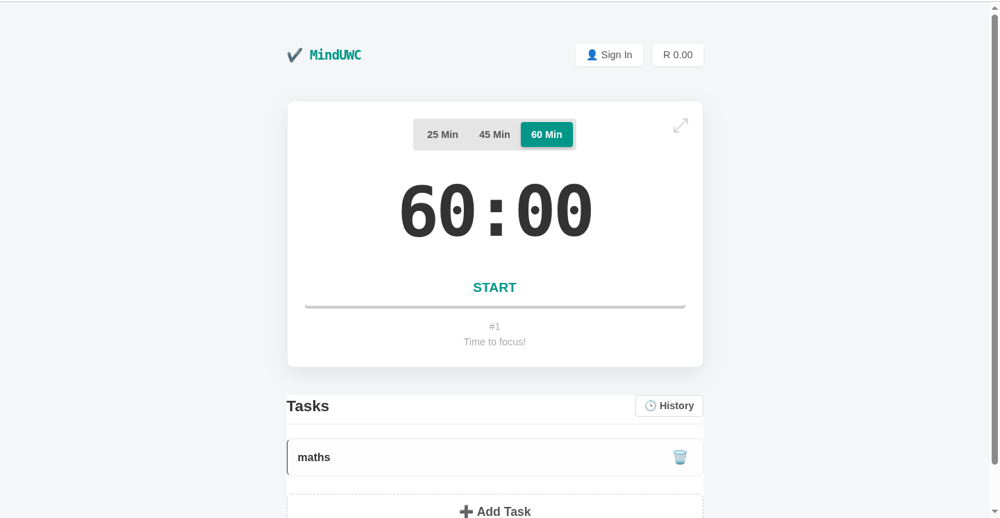

[](https://vercel.com/new/clone?repository-url=https%3A%2F%2Fgithub.com%2Fvercel%2Fexamples%2Ftree%2Fmain%2Fpython%2Fflask3&demo-title=Flask%203%20%2B%20Vercel&demo-description=Use%20Flask%203%20on%20Vercel%20with%20Serverless%20Functions%20using%20the%20Python%20Runtime.&demo-url=https%3A%2F%2Fflask3-python-template.vercel.app%2F&demo-image=https://assets.vercel.com/image/upload/v1669994156/random/flask.png)



# 🕒 Pomodoro Focus App

The **Pomodoro Focus App** is a minimalist productivity tool built to help you manage your time, improve concentration, and study efficiently using the **Pomodoro Technique**.  

It divides work into focused sessions (usually 25 minutes) followed by short breaks — ideal for deep work, studying, or coding.

---

## ✨ Features

- ⏲️ **Customizable Timer** – Set your preferred focus and break durations.  
- 📊 **Session History** – Track how many Pomodoros you’ve completed daily, weekly, and monthly.  
- 🔔 **Sound & Visual Alerts** – Get notified when to start or take a break.  
- 🌙 **Dark Mode** – Reduce eye strain during night sessions.  
- 💾 **Local Storage** – Your progress persists after closing the app.  
- 🧘 **Clean & Minimal UI** – Distraction-free environment designed for focus.

---

## 🚀 Demo

👉 **Live App:** [https://mindyuwc.vercel.app/](https://mindyuwc.vercel.app/)

---

## ⚙️ How It Works

This project uses **Flask 3** deployed on **Vercel** with Serverless Functions via the [Python Runtime](https://vercel.com/docs/concepts/functions/serverless-functions/runtimes/python).

Flask acts as a WSGI server to handle requests efficiently in a serverless environment.

---

## 🧩 Tech Stack

- **Frontend:** HTML, Tailwind CSS, JavaScript  
- **Backend:** Flask (Python 3)  
- **Deployment:** Vercel Serverless Functions  

---

## 💻 Running Locally

```bash
npm i -g vercel
vercel dev
